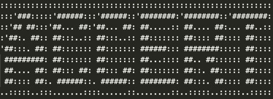

.. ACCERT User Manual documentation master file, created by
   sphinx-quickstart on Tue Jun 13 08:42:34 2023.
   You can adapt this file completely to your liking, but it should at least
   contain the root `toctree` directive.

Welcome to ACCERT User Manual!
==============================

.. .. grid:: 2
..    :gutter: 3

..    .. grid-item-card:: \ :octicon:'rocket;2em' About ACCERT
..       :text-align: center
..       :link: MainPage.rst
..       :link-type: doc
      
..       Learn what ACCERT is about here!

..    .. grid-item-card:: \ :octicon:'book;2em' Using ACCERT
..       :text-align: center
..       :link: new_page.rst
..       :link-type: doc

..       Learn how to use the ACCERT application!

..    .. grid-item-card:: \ :octicon:'terminal;2em' ACCERT Inputs
..       :text-align: center
..       :link: inputACCERT.rst
..       :link-type: doc

..       Learn about the various inputs of the ACCERT application!

..    .. grid-item-card:: \ :octicon:'comment-discussion;2em' Installing ACCERT
..       :text-align: center
..       :link: Installation.Page.rst
..       :link-type: doc

..       Learn how to install ACCERT with various operation systems!

.. toctree::
   :maxdepth: 1
   :caption: User Manual:
   

   MainPage.rst
   new_page.rst
   inputACCERT.rst
   InputExplanation.rst
   OutputsACCERT.rst

.. toctree::
   :maxdepth: 1
   :caption: Installations:

   Installation.Page.rst

Indices and tables
==================

* :ref:`genindex`
* :ref:`search`

