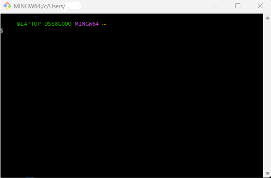
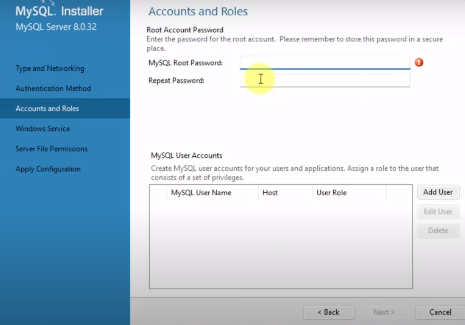

Installation For Windows
========================

For certain aspects of this process, you will need to be an administrator to download certain files. It is recommended that you follow the process on your own device, or a device where you have administrative privileges.

You will also need to have some python coding program. Visual Studio Code is heavily recommended for this, but not required.

**Cloning ACCERT**

*	In your file explorer, create a folder where you want to install ACCERT. (e.g., CODE)

*   Open a terminal window in Git.

    * If git is not yet installed, install it on the website.
    * [Git - Downloading Package] (https://git-scm.com/download/win)
    * To confirm Git installed properly, open the terminal and type in git. 
    * If various commands appear, Git is successfully installed.

*	Follow the next steps one at a time to create an ACCERT folder in your previously created folder.

.. code-block:: text

      $ mkdir CODE
      $ cd CODE
      $ git clone https://github.com/accert-dev/ACCERT.git
      $ cd ACCERT

*	If you created the folder to install ACCERT, you do not have to use the mkdir command.

Within this ACCERT folder you should have very similar stuff as the above folder.

**Install the MySQL Community Server**

*   [MySQL Community Server] (https://dev.mysql.com/downloads/mysql/)

    *   Click the recommended download.
    *   You can go through with all the recommended settings. (Developer Default)

.. admonition:: NOTE!
    
    You will have to create a **strong password encryption**, and enter said password in during the download process. **Write this password down somewhere or keep it secure with a password manager!!! It is very time consuming and difficult to reset this password!** This password does not have to be complex, nor personal info.

.. figure:: _static/password1.png
    :alt: password1
    :width: 600

**Install NEAMS Workbench**

*   [NEAMS Workbench] (https://code.ornl.gov/neams-workbench/downloads)

    *   Click the .exe extension. This is for windows.
    *   This file will be considered as unsafe. **This file is safe!** Click more options to keep the file!
    *   **Run NEAMS Workbench before continuing to the next step.**

**Set Up ACCERT**

This part has some troubleshooting to do

*	Change into the src folder

.. code-block:: text

      $ cd src

*   Editing the workbench.sh file

    *   To edit this file, open the entire ACCERT folder in your python coding application.
    *   In the src folder, open the workbench.sh python file.
    *   In here, there will be a line of code that allows the variable “workbench_path” to be set equal to something.
    *   Copy the path of the workbench folder you just installed, and paste it here.
    *   **Make sure the name of the folder does not have a space! This can mess up the code!**
    *   Save the file.

**This part is currently having issues.**

.. code-block:: text

      $ workbench_path="<Paste folder path here>"

.. code-block:: text

      $ ./setup_accert.sh

**File Navigation**

*	Using the file explorer, Create a bin file in ACCERT

*   Navigate to the bin folder in the workbench folder.

    *   Copy sonvalidxml and paste it in the ACCERT bin.
    *   Copy docprint and paste it in the ACCERT bin.

**Running ACCERT Through Python**

*	Creating the install.conf file.

        * In the file explorer, go to the src folder in the ACCERT folder.
        * Create a new text file and insert the following into it:

.. code-block:: text

      [INSTALL]

      PASSWD = yourpassword

      # NOTE: ALL OTHER information should be set up later
      # INSTALL_PATH = /usr/local
      # DATADIR =/mysql/data
      # INSTALL_PACKAGE =
      # EXP_DIR =

*  Where it says yourpassword, input the MySQL password that was previously saved.

      *	Save this text file.
      *	This text file should be named exactly as install.conf
      *	To do this, on the edit bar, click view, show, and click file name extensions.
      *	Remove the .txt from the install.conf file and save it, **even if it alters the file.**

**Testing and installing Conda**

This part requires some troubleshooting

**Errors/Troubleshooting**

*   Conda

    *   The conda application opens and does… nothing?
    *   ./conda install -r requirements when in the workbench-5.3.1/rte folder returns an error that says “bash: ./conda: Is a directory”

*   Workbench

    *   Cannot connect ACCERT to workbench
    *   When trying to run the ./setup_accert_win.bat in the terminal, it returned an error stating, “ERROR: “!line:=!” does not contain any subfolders” 